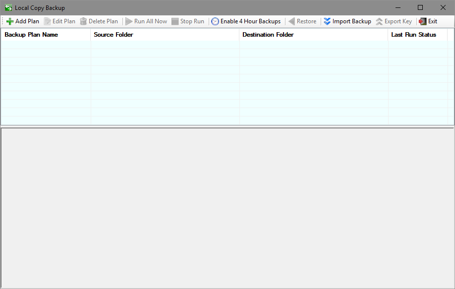
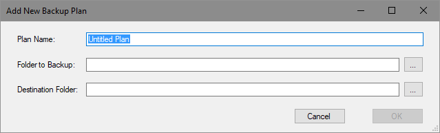

# LocalCopyBackup
C# windows application to create an compressed/encrypted local backup of folders.

# Introduction
This project was an experiment in doing 3 things in the wake of CrashPlan abandoning consumer customers:
* File copy with compression using deflate (fast with moderate results).
* File copy with encryption (AES).
* Hiding file names using GUIDs.

These are the 3 things that I felt were required for a local copy backup that is intended to sync to the cloud for backup purposes. I use One Drive only because I pay for Office 365 and a 1TB storage for free but this should work with ANY folder bases cloud syncing services.

The key for encryption MUST be kept private and saved somewhere safe. I recommend 2 copies on 2 seperate flash drives (redundancy against failure) in a static bag with non-static accumulating desecant store in a safe deposit box at the bank or fire-safe at home.

## LocalCopyBackup Features

The feature set is intentionally small.  I included only what I considered necessary for usability.
### Add/Edit/Delete a Backup Plan

The heart of this software is a backup plan. A backup plan is simply a name, a source folder, a target folder, and internally a key which can be exported. The software will generate an encrypted index file and a folder with GUID based names for the backup when run. My hope is that this is only susseptable to brute force attacks which means I am relying AES's strength. Security reviews are welcome to improve this. I am aware of keys being kept in memory during application execution but if you system is comprimised then really that is the least of your worries.
### Running and Stopping Backups

### Running and Stopping a Restore

### Timed Backups

### Importing Backups for Restore

### Exporting Keys
